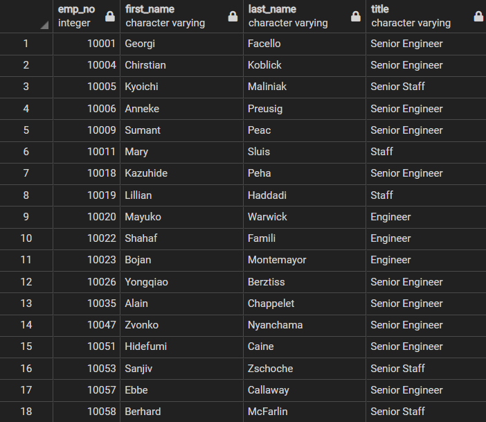
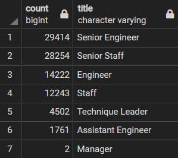
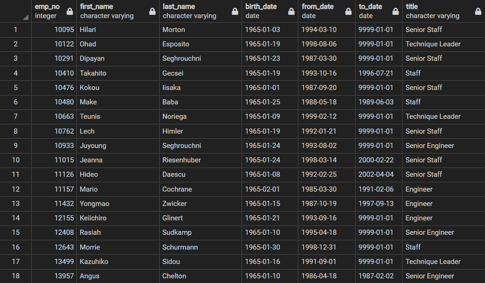

# Pewlett-Hackard-Analysis

## Overview

This analysis has two purpose:

- Determine the number of employees retiring per title
- Determine the employees eligible to participate in a mentorship program

Note: The employees eligible for the mentorship program are those born in the year 1965.

## Results

- The unique_titles.csv file

This file contains all of the employees who will be retiring along with their current title.  The original titles file contained duplicate employees because the title they were hired with differed from their current title.  By using the `DISTINCT ON()` statement, I was able to retrieve all the retiring employees only once with their most recent title.  The code to achieve this follows.

```

SELECT DISTINCT ON (rt.emp_no) rt.emp_no,
rt.first_name,
rt.last_name,
rt.title
INTO unique_titles
FROM retirement_titles as rt
ORDER BY emp_no, to_date DESC;

```

This code yields the following table.



This data may help the managers contact employees who are planning on retiring soon to discuss the process.

- The retiring_titles.csv file

This file contains the number of employees retiring per title, as shown below.



This table was produced via the `COUNT()` and `GROUP BY` functions as the code below shows.

```
SELECT COUNT(title), unique_titles.title
INTO retiring_titles
FROM unique_titles
GROUP BY unique_titles.title
ORDER BY COUNT(title) DESC;
```

This table will be useful when hiring managers are deciding how many applicants they will be taking in for each position.

- The mentorship_eligibility.csv file

This file contains the employees who are eligible for Pewlett Hackard's mentorship program.  These are employees born in the year 1965 as the table below shows.



This table was produced via conditional logic on the employees, dept_emp, and titles tables.  We also used the `DISTINCT ON()` function here to prevent duplicate employees who have held more than one title in their time with Pewlett Hackard.

```
SELECT DISTINCT ON (e.emp_no) e.emp_no,
e.first_name,
e.last_name,
e.birth_date,
de.from_date,
de.to_date,
ti.title
INTO mentorship_eligibility
FROM employees AS e
INNER JOIN dept_emp AS de
ON (e.emp_no = de.emp_no)
INNER JOIN titles AS ti
ON (e.emp_no = ti.emp_no)
WHERE (e.birth_date BETWEEN '1965-01-01' AND '1965-12-31')
ORDER BY (emp_no);
```

This table will help employers contact these qualifying employees to inquire as to whether or not they would prefer to step into a mentorship position rather than retiring.

- There are a lot of retiring employees

Over 90,000 employees are retiring, so Pewlett Hackard needs to get a jump on hiring before there are too many vacant positions to fill quickly.

## Summary

- How many roles will need to be filled?
  
By using the following code, we can see that 90,398 roles will need to be filled when all the listed employees have retired.

```
SELECT COUNT(emp_no)
FROM unique_titles;
```

- Are there enough qualified, retirement-ready employees in the departments to mentor the next generation of employees?

By using the following code, we can see that there are 1,940 employees eligible for the mentorship program.

```
SELECT COUNT(emp_no)
FROM unique_titles;
```

Even if every single one of these eligible employees elects to become a mentor, then each mentor would be responsible for about 47 new employees.  This is too many mentees for one mentor to handle, and it is likely not all eligible employees will elect to become mentors, so the new employees per mentor number would likely be much higher than 47.

- Possible further insights

It is not likely that every single employee who is eligible to retire will.  It would be highly beneficial if we had a table of which employees eligible for retirement actually plan on retiring so that we may better prepare for the future.

From this table, we could have a "mentor?" = (Y/N) column that would allow us to query the number of mentors we would have per job title.  We could then get a better estimate of how many mentors per job title we would have available to train new hires.